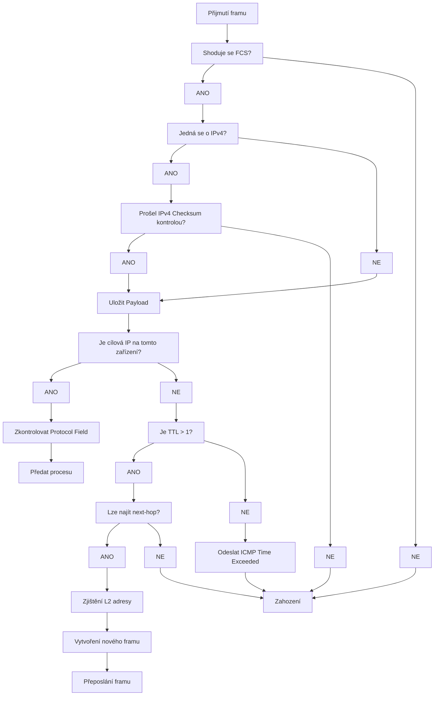

# IP Forwarding
---

*IP Forwarding* nebo *IP Routing* je proces, který má za úkol najít cestu pro příchozí paket.
Tento proces musí být relativně jednoduchý, aby mohl router zpracovávat velké množství paketů.

Základní proces, bez různých vylepšení jako [[CEF]] a [[Fast Switching]] funguje následovně:

1. Router dostane Frame, zkontroluje [[MAC#Hlavička Ethernet II|FCS]], pokud je součet chybný, paket zahodí, pokud není, router zkontroluje [[MAC#Hlavička Ethernet II|Ether Type]] a uloží Payload (L3 paket)
2. Pokud se jedná o [[IPv4]] paket, zkontroluje Checksum, pokud [[IPv6]] ke kontrole nedochází
3. Pokud paket prošel kontrolou, router zkontroluje, zda není cílová IP adresa adresa routeru, pokud ano, router zkontroluje Protocol Field v IP hlavičce a předá paket procesu
4. Pokud cílová IP adresa není lokální, paket musí být přesměrován, router zkontroluje, zda TTL > 1, pokud ne, odešle [[MSTP#ICMP Time Exceeded|ICMP Time Exceeded]] na zdrojovou IP adresu
5. Pokud je vyšší, router zkontroluje RIB pro nejvhodnější cestu na základě masky sítě
6. Záznam v RIB obsahuje next-hop adresu a interface, ze kterého se má paket odeslat, pomocí děchto informací zjistí L2 adresu, na kterou má frame poslat (ARP, DLCI...)
7. Změní TTL a vytvoří novou L2 hlavičku a patičku s novým FCS
8. Přepošle frame na next-hop

## Process Switching

Předešlý algoritmus je také nazýván jako *Process Switching*, jedná se o základní a nejpomalejší způsob forwardování z mnoha důvodů, například i proto, že běží na *General Purpose CPU*.
Jeho část, 5. - 6. (vyhledávání v RIB), je nejpomalejší z celého procesu. Z toto důvodu přišlo Cisco s řadou vylepšení souhrně nazývanými *Switching Paths*, dnes se jedná zejména o [[CEF]] a [[Fast Switching]].

Ale tento proces se stále využívá v případě, že *Switching Paths* algoritmy si nedokáží s provozem poradit.

Tento proces, `ip_input`, je spouštěn periodicky, při každém spuštění zjištujě, zda jsou k dispozici pakety pro routing, tudíš se s příchozím paketem nepracuje inhned, co dorazí, ale je uložen do bufferu.