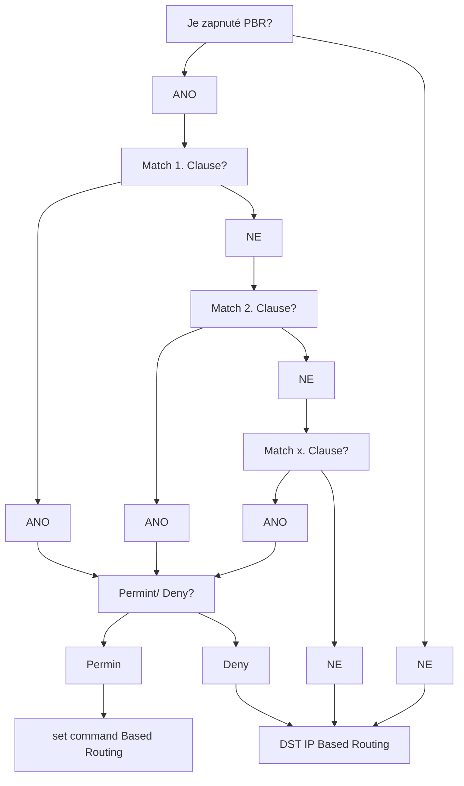

# Policy Based Routing
---

Za běžných podmínek, [[IP Forwarding]], se forwarduje pouze na základě cílové IP adresy, z různých důvodů můžeme tuto logiku upravit a určit manuálně next-hop adresu v případě určité podmínky.
Takovémuto rozhodování se říká *Policy Based Routing (PBR)* a vkládá do původního algoritmu, [[IP Forwarding]], za zkontrolování IPv4 Chechsumu a před zkontrolováním TTL další rozhodovací strom:

## Schéma




## Konfigurace

PBR nabízí širokou možnost `set` příkazů, tedy pokynů, co se má s paketem stát v případě, že splní podmínky (klauzule) z nastaveného [[ACL]].

Nejedná se pouze o next-hop adresu, ale i [[QoS]], [[BGP]] nebo odchozí interface.

### [[ACL]]

Nejprve je potřeba vytvořit [[ACL]], dle které se filtruje provoz, na který mají být pravidla použita.

### route-map

Následně je potřeba nastavit samotné PBR, a to pod názvem route-map.

```
R(config)#route-map <NAME>     \\ Přepnutí se na route-map
R(config-route-map)#match <ip <ACL>>     \\ Nastavení podmínky, která se má sledovat
```

`match` podmínka se nejčastěji používá ve spojení s IP adresací, ale má mnohem rozšířenější podporu, například může sledovat [[FHRPs#Object Tracking|Object Tracking]], velikost paketu nebo typ routy, kterou by paket měl jít.

```
R(config-route-map)#set <ip next-hop <IP>>     \\ Nastavení next-hop adresy
```

Opět, `set` příkaz se dá použít mnoha způsoby, nejčastěji next-hop adresou.

#### Default

`set` příkazy umožňují i použítí `default` argumentu, takto nastavený příkaz se vykoná pouze v případě, že neexistuje žádná normánlí forwardovací logika, která by si s paketem poradila, například, pokud nemáme Default GW a chceme ji nastavit pouze pro určité sítě, můžeme použít tento příkaz.

```
R(config-route-map)#set ip default next-hop <IP>
```

#### Default Interface

Tento příkaz je doporučeno používat pouze na *p-t-p* interfacech, na *multiaccess* interfacech je trochu neintuitivní:

Na [[IPv6]] vůbec nefunguje a na [[IPv4]] router nejprve pomocí FIB zjistí next-hop IP adresu a pak se dle tohoto příkazu snaží zjistit L2 adresu pro tento interface.
Tento proces může často selhat z několika důvodů:
1. RIB vůbec nemá next-hop IP
2. FIB sice má next-hop IP, ale není na specifikovaném interfacu

[[RARP, PARP, BOOTP#Proxy ARP|Proxy ARP]] v tomto případě nepomůže, protože router kontroluje, zda IP adresa, ze které ARP Response přišlo je dosažitelná interfacem, na který přišlo.
Tato chybová hláška je pak označená jako *wrong cable* v `debug arp`.
