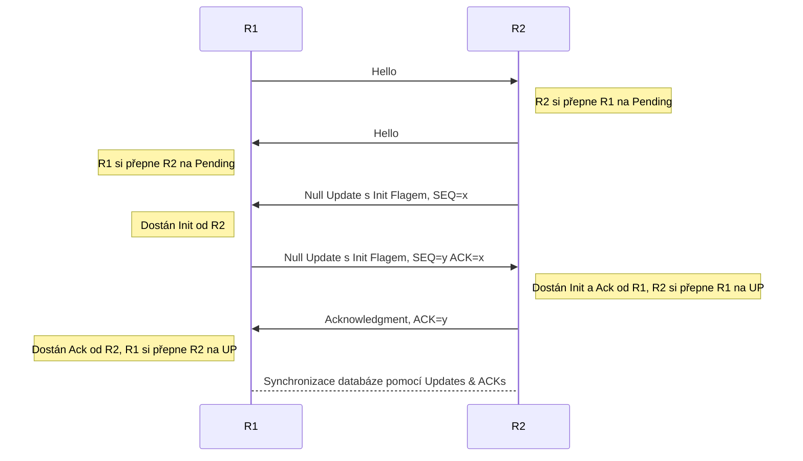

# Enhanced Interior Gateway Routing Protocol
---

Jedná se o Cisco protokol, dříve proprietální, roku 2016 z části uvolněn v  [RFC7868](https://datatracker.ietf.org/doc/html/rfc7868), který vychází z původního Cisco protokolu IGRP, který v době jeho vzniku konkuroval [[RIP|RIPv1]] (1980s), oproti RIPu přinášel řadu výhod jako zvýšení hop-countu na 255 a propracovanou metriku, ale také s ním sdílel řadu problémů, typicky problémy smyček, update intervaly a periodické posílání celé RIB.

Cisco v roce 1993 nahradilo IGRP za "vylepšenou" verzi *EIGRP*.

Je to [[Routing#IGP - Interior Gateway Protocol|IGP]] & [[Routing#Distance-Vector|Advanced distance-vector]] protokol, který formuje sousedství a pouze při navázání sousedství a změně sítě posílá routovací informace.

## Router Adjacencies
---

EIGRP udržuje sousedství, sousedy může dynamicky objevovat pomocí [[EIGRP Pakety#Hello|Hello]] paketů nebo mohou být manuálně nastavena.

Manuální nastavení zároveň vypne jakoukoliv multicast funkcionalitu na interfacu, na kterém se spoj odehrává, nelze tedy na stejném interfacu mít manuálně nastaveného souseda spolu s dynamicky nastavenými sousedy, musí se používat manuální konfigurace, nebo dynamická.

Pro vytvoření sousedství musí mit zařízení shodných několik hodnot:
- Autentizace
- K-Values
- AS
- Síť
- Primární adresy pro EIGRP sousedství

Stojí za zmínku, že časovače nemusí být shodné.

### Navazování sousedství

Router periodicky rozesílá Hello pakety, po přijmutí paketu na interface okamžitě router odešle vlastní Hello paket z onoho interfacu.
Po příjmutí Hello paketu od souseda si ho router přepne na *Pending* stav, ten značí existenci souseda, ale protože zatím není potrvzena plná (*bidirectional*) konektivita, žádné informace od něho nejsou přijímány.
Router zatím přijímá pouze Update paket s nastaveným Init flagem.

Pro potvrzení plné konektivity následně router pošle sousedovi v Pending stavu prázdný (*Null*) Update paket s nastaveným Init flagem a sekvenčním číslem. Následně čeká na ACK na tento paket pro potvrzení spoje, po jeho příjmutí si přepne sousední router do stavu *Up*.

Poté, co tento spoj potvrdí oba routery, tedy je navázáno sousedství, začne synchronizace kompletních routovacích informací, které mají routery k dispozici pomocí Update paketů.

Po příjmutí posledního update paketu s nastaveným *End-of-Table* flagem, tedy po ukončení synchronizace, Update pakety se posílají pouze při změně sítě.

Při spuštění příkazu `R#show ip eigrp neighbors` zobrazené informace obsahují, mimo jiného, i:

#### Q cnt

Označuje počet paketů, které byly odeslány bez příchozího ACK.

#### Seq Num

Označuje poslední známé sekvenční číslo od souseda.

### Časovače

#### Hello

Defaultně 5s, na NBMA s bandwithem pod T1 60s.

Čas, po kterém se periodicky posílají Hello pakety pro udržení sousedství.

#### Hold

Defaultně se jedná o 3x Hello timer, změna Hello časovače ale automaticky nevede k přepočítání Hold Timeru!

V případě, že v tomto časovém okně nedostane router od souseda paket, prohlásí ho za unreachable a do [[EIGRP DUAL]] ohlásí ztrátu souseda.

Hold timer je přenášen v Hello paketu a říká sousedům, jak dlouho na něho mají čekat, nastavení této hodnoty tedy mění dobu čekání sousedních routerů na lokální, ne lokálního na ostatní.

#### SRRT

*Smooth round-trip time*

Je průměrný čas v milisekundách mezi odesláním paketu a dostáním ACK.

#### RTO

*Retransmit Time-Out*

Jedná se o čas, kterou bude router čekat na ACK před znovuodesláním unicast paketu.

## Reliable Transport Protocol (RTP)
---
Spravuje spolehlivou přepravu paketů, stará se o to, aby byli doručeny a ve správném pořadí zpracovány.
Toho je docíleno pomocí Cisco vyvynutého protokolu známého jako *Reliable Multicast*.
EIGRP pakety byužívající tohoto protokolu jsou:
- [[EIGRP Pakety#Update|Update]]
- [[EIGRP Pakety#Query|Query]]
- [[EIGRP Pakety#Reply|Reply]]
- [[EIGRP Pakety#SIA-Query|SIA-Query]]
- [[EIGRP Pakety#SIA-Reply|SIA-Reply]]

v jak unicast, tak multicast podobě.

Každý z těchto paketů obsahuje nenulovou hodnotu [[EIGRP Pakety#Sequence Number|Sequence Number]], která je signifikantní pro vnitřní EIGRP proces a každý následující odeslaný paket, z těchto, toto číslo zvýší o 1.
Každý ze sousedů, kterému příjde takovýto paket, musí odeslat jiný paket s [[EIGRP Pakety#Acknowledgment Number|Acknowledgment Number]] rovnému sekvenčnímu číslu přijatého paketu.
Tento ACK paket může být prázdný [[EIGRP Pakety#Hello|Hello]] paket nebo může být ACK poslán i jako součást paketu s daty.

Pakety, u kterých není potřeba spolehlivost, ([[EIGRP Pakety#Hello|Hello]] a [[EIGRP Pakety#Acknowledgment|Acknowledgment]]), mají sekvenční číslo nastavené na 0.

Při posílání paketů v multicastu je požadován ACK paket pro potvrzení příjmutí, pokud ho odesílatel nedostane od všech příjemců, nemůže pokračovat v posílání dalších paketů a nedojité pakety přepošle znovu, tentokrát jako unicast.
Vzhledem k tomu, že odesílatel nemůže pokračovat v posílání dokud nedojde k plné ACK předešlých paketů, může dojít k vážnému zalagování sítě kvůli jednomu problematickému zařízení.
RTP toto řeší pomocí *Conditional Recieve*, využívá [[EIGRP Pakety#Flags|Flag]], pomocí které dělí pakety na 2 skupiny, nadále odesílá unicast pakety zařízením, které neposlali ACK, a také posílá multicast informace s flagem říkajícím, aby onu zprávu přijímali pouze zařízení, které dostali všechny předešlé. 
Toho je docíleno tak, že odesílající router pošle Hello paket se 2 specifickými [[EIGRP Pakety#TVL|TVL]] poli, Sequence TLV a Next Multicast TLV, nazývané taky jako Sequence Hello.
Next Multicast TLV obsahuje sekvenční číslo nadcházejícího multicast paketu a Sequence TLV obsahuje seznam všech nefunkčních zařízení, jejich IP adres.
Pokud zařízení příjme tento Hello paket a nenajde se v Sequence TLV seznamu, přepne se do *Conditional Recieve* (CR) módu. Oproti tomu zařízení zmíněné v seznamu zůstane v klasickém stavu.
Následně odešle router multicast paket s nastaveným `0x2` flagem (CR), tuto zprávu mohou příjmout pouze zařízení v CR módu.
Díky tomuto mechanismu mohou správně fungující zařízení nadále komunikovat multicastem a nefungující zařízení budou dostávat jeden paket za druhým unicastem.

Časový interval dle kterého se zařízení prohlásí za lagující je specifikován jako *Multicast flow timer*.
Čas mezi následujícími unicasty je specifikován jako *Retransmission timeout* (RTO).
Oba tyto časovače jsou určeny pro každého souseda zvlášť na základě *Smooth round-trip time* (SRTT), což je průměrný čas v milisekundách mezi odesláním paketu a dostáním ACK.
Přesný výpočet není potřeba pro složení CCIEv7 R&S vzhledem k tomu, že ho nelze nijak ovlivnit.

