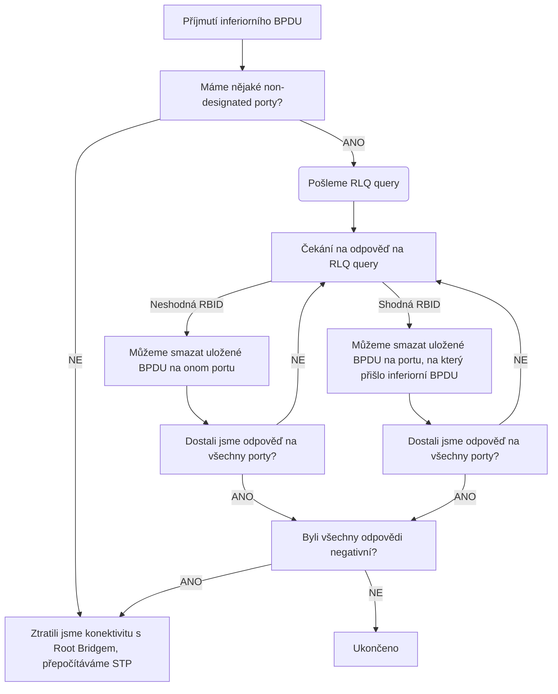

# STP Funkce
---

## Root Guard
---

Tato funkce se zapíná per-port a zamezuje portu přepnout se do RP role, pokud dostane superiorní [[STP Terminologie#Configuration BPDU 0x00|BPDU]], přepne se do [[#ErrDisabled]] stavu.


```
SW(config-if)#spanning-tree guard root
```

Používá se na [[STP Terminologie#Edge|Edge porty]] nebo na [[STP Terminologie#Designated|Designated porty]] ku switchi, který by se neměl stát Root Bridgem.

## STP Portfast
---

Tato funkce umožňuje portu se přepnout z [[STP Terminologie#Blocking|Blocking]] přímo do [[STP Terminologie#Forwarding|Forwarding]] stavu a při zapnutí/vypnutí linky negeneruje [[STP Terminologie#Topology Change Notification BPDU 0x80|TC BPDUs]].
Doporučuje se pouze na Access, [[STP Terminologie#Edge|Edge]] a porty pro koncová zařízení, díky této funkci nemusí uživatel při každém odpojení čekat 50s na připojení.
Zároveň v případě [[Rapid STP|RSTP]] nepotřebuje Proposal/Agreement pro přepnutí do [[STP Terminologie#Forwarding|Forwarding stavu]], bez této funkcionality by se port přepnul na [[STP|legacy STP]] a uživatel by musel projít [[STP Terminologie#Forward Delay|Forward Delay timery]].

Pokud na tento port příjde [[STP Terminologie#Configuration BPDU 0x00|BPDU]] okamžitě se z něho funkcionalita Portfast odstraní.

```
SW(config-if)#spanning-tree portfast
SW(config)#spanning-tree portfast default     \\ Přepne pouze Acces porty
SW(config-if)#spanning-tree portfast disable
``` 

Portfast lze nastavit i na Trunk, ale toto nastavení je doporučeno například v případě, že jde o linku k serveru.

```
SW(config-if)#spanning-tree portfast trunk
```

Nepoužívání této funkcionality může znamenat problémy s [[DHCP]] a PEX.

### BPDU Guard

Jedná se o funkcionalitu Portfastu, která mění chování při přijetí [[STP Terminologie#Configuration BPDU 0x00|BPDU]], za normálních okolností se pouze zruší Portfast na portu, s BPDU Gurdem se přepne do [[#ErrDisabled]] stavu.

```
SW(config)#spanning-tree portfast bpduguard default
SW(config-if)#spanning-tree portfast bpduguard {enable|disable}
```

### BPDU Filter

Jedná se o funkcionalitu Portfastu, která mění chování při přijetí [[STP Terminologie#Configuration BPDU 0x00|BPDU]].
Pokud na port s touto funkcionalitou příjde [[STP Terminologie#Configuration BPDU 0x00|BPDU]], tak ji prostě zahodí a již nepřeposílá dále, také z portů s touto funkcionalitou neposílá [[STP Terminologie#Configuration BPDU 0x00|BPDU]].

|Stav|BPDU Guard|Filter|
|:-:|:-:|:-:|
|Příjem|Přepne port do ErrDisabled stavu|Zahodí BPDU|
|Odesílání|Přeposílá BPDUs|Neposílá BPDUs|

BPDU Filter má přednost před BPDU Guard.

#### Global

V případě nastavení BPDU Filteru globálně, ne per-port, funkcionalota se trochu změní.

1. V případě příjmutí [[STP Terminologie#Configuration BPDU 0x00|BPDU]] port ho nezahodí, ale naopak vypne funkcionalitu Portfast a BPDU Filteru a začne fungovat jako normální port
2. Po nastavení rozešle z příslušných portů 10 - 12 [[STP Terminologie#Configuration BPDU 0x00|BPDUs]] a čeká na odpověď, následně postupuje dle bodu 1.

## ErrDisabled

Defaultně pro odstranění portu z [[#ErrDisabled]] stavu je nutné ho vypnout a zapnout, to lze přenastavit.

```
SW(config)#errdisable recovery cause bpduguard
SW(config)#errdisable recovery interval <interval>
```

## STP Loop Guard 
---
[[UDLD]]
V případě *Unidirectional link failure* může dojít k tomu, že máme konektivitu přes [[STP Terminologie#Root|RP]], ale nedostáváme Superior [[STP Terminologie#Configuration BPDU 0x00|BPDUs]], tato funkce zabraňuje [[STP Terminologie#Root|RP]], aby se stal [[STP Terminologie#Designated|Designated]] , což by se po uplynutí [[STP Terminologie#Max Age|Max Age]] timeru stalo.
Loop Guard je přepne do [[#ErrDisabled]] stavu, dokud znovu nedostane [[STP Terminologie#Configuration BPDU 0x00|BPDU]]. Port v takovém stavu je považován za *P2p LOOP_Inc*, což lze ověřit příkazem `SW#show spanning-tree inconsistentports`.

Tato funkce se používá v případě, že máme nespolehlivou optickou linku, o které víme, že by mohlo dojít k dočasnému vypadnutí spoje na [[STP Terminologie#Root|RP]], pro zamezení změny celé topologie lze použít tuto funkci.

Je nutné s ní ale zacházet opatrně, protože zároveň zamezuje možnosti konvergence sítě v případě, že se nejedná o dočasnoý výpadek, ale komplexní chybu sítě.

## Bridge Assurance
---

Princip, respektive důvod, této funkcionality je stejný, jako u STP Loop Guard, pro případ *Unidirectional link failure* se snaží předejím vytvoření smyčky.
Oproti Loop Guardu tím ale předchází tak, že všechny porty, i [[STP Terminologie#Blocking|Blocking]], posílají své [[STP Terminologie#Configuration BPDU 0x00|BPDUs]] a v případě, že protistrana nedostane toto[[STP Terminologie#Configuration BPDU 0x00|BPDU]], přepne port do *P2p LOOP_Inc* [[STP Terminologie#Blocking|Blocking]] stavu, dokud mu nepříjde.

Tato funkce je pouze pro [[MSTP]] a [[Per-VLAN STPs|RPVST+]].

Rozdíl s Loop Guardem je v tom, že jednak posílá [[STP Terminologie#Configuration BPDU 0x00|BPDUs]], ale hlavně Loop Guard nemůže být nastaven na [[STP Terminologie#Designated|Designated]] porty, kdežto Bridge Assurance funguje pro celou síť.

```
SW(config)#spanning-tree bridge assurance
SW(config-if)#spanning-tree portfast network
```

## Dispute

Jedná se o stav, při kterém v [[Rapid STP#RSTP Synchronization Process|RSTP Synchronization Process]], pokud posíláme superioriní BPDU, ale nedostáváme odpověď s příjmutím, znamená to, že sousední switch nedostal naše superiorní BPDU, a tak je up-link nedostupný. 

## UplinkFast
---

Umožňuje okamžité přepnutí non-designated portu na [[STP Terminologie#Root|RP]] v případě selhání původního [[STP Terminologie#Root|RP]].
Je defaultně zabudovaný v [[Rapid STP|RSTP]].

## BackboneFast
---

Při strátě [[STP Terminologie#Root|RP]] a [[STP Terminologie#Designated|Designated]] portu proti [[STP Terminologie#Non-designated|non-designated]], trvá 50s pro změnu z [[STP Terminologie#Non-designated|non-designated]] portu na [[STP Terminologie#Designated|Designated]].
BackboneFast pomáhá zkrátit [[STP Terminologie#Max Age|Max Age]] timer na 0 díky tomu, že port na odblokování už nemusí čekat na vypršení superiorního [[STP Terminologie#Configuration BPDU 0x00|BPDU]].

Switch, který ztratí [[STP Terminologie#Root|RP]] a nemá náhradní konektivitu začne sám sebe považovat za Root Bridge a začne posílat jeho vlastní [[STP Terminologie#Configuration BPDU 0x00|BPDUs]], které přicházejí i na zablokovaný port sousedního switche, ty jsou ovšem inferiorní, a tak na ně není brán zřetel a čeká se na vypršení [[STP Terminologie#Max Age|Max Age]] timeru pro přepnutí portu do [[STP Terminologie#Designated|Designated]] stavu a přeposílání jeho [[STP Terminologie#Configuration BPDU 0x00|BPDUs]].

S funkcionalitou BackboneFast v případě, že vedlejší switch dostane toto inferiorní [[STP Terminologie#Configuration BPDU 0x00|BPDU]] pošle ze všech non-designated portů, tedy i RP, *Root Link Query Protocol Data Unit ([[#RLQ]])* Request, který má za úkol získat odpověd, jedná se o podobný mechanismus jako ping, pokud Root Bridge přijme tento Request, odpoví na něj pomocí *RLQ Response*, pokud na non-designated port příjde Response se stejným [[STP Terminologie#Root Bridge ID RBID|RBID]], jako jeho [[STP Terminologie#Root Bridge ID RBID|RBID]], pak je na tomto portu funkční konektivita, pokud příjde jiný, port okamžitě odblokuje.
Po přijetí Response na všech portech, které poslaly request, se odblokuje i původní port, na který přišlo první inferiorní BPDU.

#### RLQ

Jedná se o standartní STP [[STP Terminologie#Configuration BPDU 0x00|BPDU]] s tím, že v [[LLC]] [[LLC#SNAP|SNAP]] hlavičce obsahuje speciální, Cisco, adresu.

### Schéma




